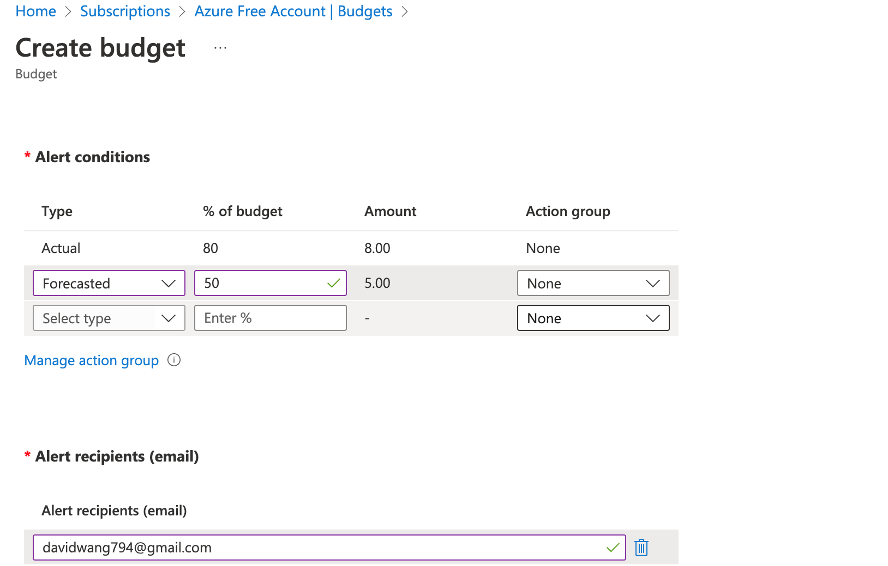
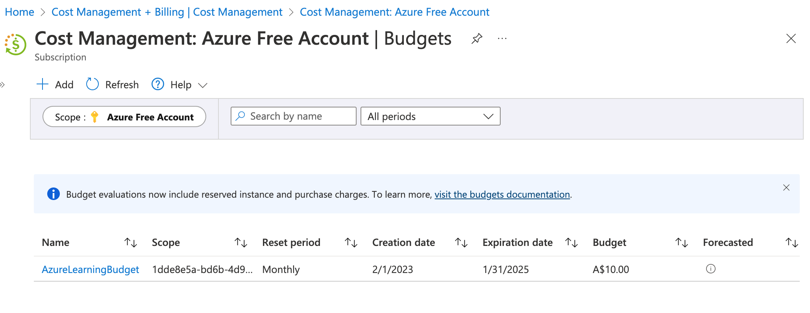
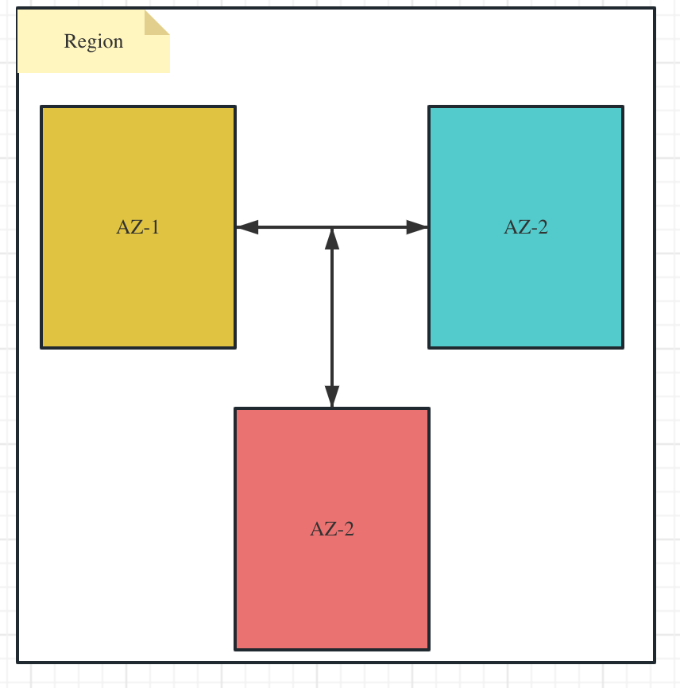

# Azure Cloud Basics

# 1. Create Free Azure Subscription

Azure Free Account Register: https://azure.microsoft.com/en-us/free/

Azure Login Page: http://portal.azure.com/

# 2. Azure Portal Overview

Azure Login Page: http://portal.azure.com/

## 2.1 Services and Resources

A service is what is needed to perform a task, which could be one or more resources.

An Azure resource is a billable entity, such as a virtual machine instance or storage account.

Azure holds both Microsoft and third-parties‘ services and resources.

## 2.2 Azure Cloud Shell

Cloud Shell is used to manage Azure services in CLI

# 3. Delete Resoureces and Set Budget

## 3.1 Azure Subscription

- Free Subscription:
  - Azure won't charge you for your free subscription
  - Your FREE subscription and services are disabled after 12 months
  - You must upgrade to continue using Azure services

Once your free credit is exipired, you will need to upgrade your Azure free account

- Paid Subscription:
  - Delete resources if they are not used any more
- Set Alert - notify you when your spending reaches or exceeds the amount defined in the alert condition of the budget

## 3.2 Delete Resources

All resoures created will be shown here in the list, choose the one needs to be deleted, and click **Delete** button

Once it is deleted, you will lose this resource

## 3.3 Rename Subscription

Search for subscription in the search bar and choose **Subscriptions**

All subscriptions will be listed, and you can double click to see the details

You can change subscription name

## 3.4 Setup Budget for Subscription

# 4. Computing Models - IaaS vs PaaS vs SaaS

# 5. Deployment Models - Public Private Hybird

**Public Could:** Could resources are those that are owned and managed by a third-party cloud service provider and are provided through the Internet

​	Advantages:

​			No Maintenance

​			Near unlimited scalability

​			High reliability

​	Disadvantages:

​			Less control

​	User case scenario:

​			Deploy website quickly

​			Focus on development

**Private Cloud:** Cloud services thaat are utilized by a particular organization and are not accessible to the general public

​	Advantages:

​			No Legal obligation

​			Control

​			Strict security and compliance

​	Disadvantages:

​			Infrastructure cost

​			Diffcult to elasticity

​			IT Skills

​	User case scenario:

​			Government policy requires specific data to be kept in-country

**Hybrid Cloud:** Combination of public and private cloud with automation and orchestration between the two

​	Advantages:

​			User your own equipment to meet security, compliance, or legacy scenarios

​	Disvatages:

​			Expensive

​			Complicated

​	User case scenario:

​			Medical data can't expose to public

​			Application runs on old hardware

# 6. Cloud Pricing Model

**Traditional Data Center Cost:**

​	Upfront Hareware cost

​	Building, electricity, cooling, Internet

​	Employees to maintain infrastructure

​	Software/Application licenses

​	And so on...

**Could Computing Cost:**

​	Can we save money?: Yes, but it's not straight forward

​	Bill could depends on multiple metrics for each service

​	Example: "Storage Service" pricing depends on:

​			Volume of data stored per month

​			Quantity and types of operations performed

​			Data transfer costs

​			Data redundancy/backups

​	Example "VM" Pricing depends on:

​			Overall CPU time

​			Time spent with a public IP address

​			Incoming(ingress) and outgoing(egress)network traffice in and out of the VM

​			Disk size and amount of disk read and disk write operations

**Azure always Free:**

​	Virtual Network

​	Azure Policy

​	Azure Active Directory

​	Azure Migrate

​	Azure Open Datasets

​	Azure Lighthouse

​	Azure Private Link

​	Azure Data Catalog

​	Azure Service Fabric

**Pay by Time:**

​	Charge based on the time you use a particular service

​	Other imp parameters like perfomance tiers and other configurations

​	Examples:

​			Virtual Machine

​			App Services

​			SQL Database

​			Load Balancer

**Pay by GBs:**

​	Database Storage

​	Storage Service

​	Network Traffic(between regions)

**Pay by Operations:**

​	Charges based on number of operations

​	Example: Cost per million operations

​			Storage services (read, write or delete operations)

​			Cosmos DB

**Pay by Executions:**

​	Serverless offerings

​	Charges only when you use, per execution

​			Azure Function: 1 million Execution  Free / month

​			Serverless Database

​			Logic Apps

**Other Metrics:**

​	Example: Azure Active Directory Premium tier

​			Charge based on number of user licenses

**Other Parameters:**

​	Regions/Locations

​	How you purchase service:

​			Through an Enterprise Agreement

​			Directly from the web

​			Through a Cloud Solution Provider

​	Support options: product support

​	Programs and offers

​	And so on...

For on-premises infrastructure: you can calculate the cost

For cloud infrastructure: it depends on various factors

https://azure.microsoft.com/en-au/pricing/#product-pricing

# 7. How to keep using Azure Portal for FREE in Sandbox

# 8. Data Center Regions and Region Pair

**Region:** 

​	a physical location around the world where to hold cluster data centers

​	can be used for better scalability and redundancy

​	preserver data residency

​		low latency: different regions are connected with each other

​		global footprint

​		high availability

​	how to choose region?

​		Compliance: data privacy, etc.

​		Priximity

​		Avaibable Services: https://azure.microsoft.com/en-au/explore/global-infrastructure/products-by-region/

​		Pricing

**Region Pair:**

​	https://learn.microsoft.com/en-us/azure/reliability/cross-region-replication-azure

​	every region in Azure is paird with another region in the same geographical area

​	data centers are usuallt 300+ miles apart

​	automatic replication and failover for some Azure services

​	2 regions in a pair are connected with high-speed network cable

​	additional advantages of region pairs:

​			if an extensive Azure outage occurs, one region out of every pair is prioritized to make sure at least one is restored as quickly as possible for application hosted in that region pair

​			planned Azure updates are rolled out to paired regions one region at a time to minimize downtime and risk of application outage

​		Data continues to reside with the same gepgraphy as its pair

# 9. Availability Zones

Region represents a separate geographic area

Availability zone is a set of discrete data centers

Availability zones is set up to be an isolation boundary. If one zone goes down, the other continues workings

Each availability zone has independent power, cooling and networking

Availability zones are connected via high bandwidth, ultra-low latency networking

AZs are physical separated by serveral kilometers, while being within 100km (60 miles) of one each

All AZ traffic is encrypted

Not every region has support for availability zones

# 10. Resource Groups

**Resources:** Resources are instances of services that you create, like virtual machine, storage, or SQL databases. Any instance of any service is a resource. 

We group resources into a resource group.

**Resource groups:** Resources are combined into resource groups, which act as a logical container into which Azure resources like web apps, databases, and storage accounts are deployed and managed.

A resource group is a logic concept that groups your Azure resources. It can be a resource group for virtual machine, database and etc.

A resource group only saves meta data, and resources in the same resource group can be in different regions.

For example, we can put all resources of our application into one resource group.

**Subscription:** It is used for billing purpose and will get monthly bill. Subscription can be used per environment, for example, Prod subscription and Stage/Dev subscription. **Spend restriction can be set at subscription level.** For example, Stage/Dev subscription can only have $10000, so developers can use it efficiently.

A subscription groups together user accounts and the resources that have been created by those user accounts. For each subscription, there are limits or quotas on the amount of resources that you can create and use. Organizations can use subscriptions to manage costs and the resources that are created by users, teams, or projects.

**Management groups:** These group help you manage access, policy, and compliance for multiple subscriptions. All subscriptions in a management group automatically inherit the conditions applied to the management group.

For example, you can have different subscriptions per customer organizatons or per different geographic location.

**Resource Groups:**

Resources: ae anyting you create in an Azure subscription like VMs, Azure Application Gateway instances, and Azure Cosmos DB instances.

Resource group is a logical container which help manage and organize your Azure resources.

​	For example: similiar usage, type, or location

**Each resource can exist in only one resource group.** 

You can move a resource from one resource group to another groups.

**Resource groups can't be nested.** Within a resource group, you can only create resources.

The resources in a resource group can be located in different regions than the resource group.

Resource group can be in USA, but its resource can locate in Australia, India, etc.

Resource group is created based on a location - to store metadata.

A resource group can be used to scope access control for administration actions. To manage a resource group, you can assign Azure Policies, Azure roles, or resource locks.

You can apply tags to a resource group. The resoureces in the resource group don't inherit those tags.

Life cycle: When you delete a resource group, all resources in the resource group are also deleted.

To create a resource group, you can use the portal, PowerShell, Azure CLI, or an ARM template.

# 11. Azure Resource Manager

Deployment and management service for Azure

For example, after a user creates a resource, say a virtual machine,  it will send a request to Azure resource manager and Azure resource manager will check if this user has right access to create virtual machine and will create resource eventually

Automate resource deployments(create, update and delete)sing templates

ARM template is a JSON file that defines what you want to deploy to Azure

Integrates with Azure portal, PowerShell, CLI and REST API for to perform deployment and mangement task

Easy way to deploy multuple resource instancess or repiably redeploy resources

ARM template can be used to deploy resources so they're deployed in the correct order

# 12. Subscription

How you are billed for resource usage

One Azure account can have multiple different subscriptions

Each subscription has its own independent bill

Different subscritions have different restrictions, like how many VMs can be created, how much money can be spent each month

Fox example, a company can have 2 subscriptions.

One for Dev and one for Prod.

The Dev subscrition has restricted access to create resource, for example., it cannot create expensive VMs

The Prod subscrition doesn't have restrictions and it can create expensive but more productive VMs

Using Azure requires an Azure subscription

An Azure subscription is a logical unit of Azure services that links to an Azure account. It also allows you to provision resource

A subscription provides you with authenticated and authorized access to Azure prodicts and services 

Azure generates separate billing reports and invoices for each subscription

Two types of subscription boundaries:

​	Billing boundary

​	Access control boundary

You can create separate subscription based on:

​	Environment: development and testing, security, or to isolate data for compliance reasons

​	Organization structures: IT, HR, Admin and so on

​	Billing: manage and track costs based on your needs, for example - Production, Test and Dev

Different types of Subscription:

​	FREE: An email address and a credit card are required to sign up for a free trial subscription that provides $200 credit for the first 30 days and 12 months of restricted access

​	Pay-Per-Use: Charges monthly based on Cloud resource use

​	Enterprise: A single Enterprise agreement is established for large subscription purchases, including saving for new licenses and Software Assurance

​	Student: This membership includes $100 for 12 months and may be activated without a credit card

# 13. Management Groups

Organize multiple subscriptions as a single management entity

Management groups let you organize multiple subscriptions as a single management entity to facilitate eaiser management

You can create managements groups in a hierarchical structure with the top level of te hierarchy at the tenant level and containing all subscriptions in the tenant

Any conditions applied to a management group apply to all subscriptions contained in that maangement group object

Each management group and subscription can support only one parent

Each management group can have many children

The root management group can't be moved or deleted, unlike other management groups
