# Azure Identities and Governance

# 1. Azure Active Directory

**Azure Active Directory:** 

- AAD has Four editions:
  - Free: MFA, SSO, Basic Security and Usage Reports, User Management
  - Office 365 Apps: Company Branding, SLA, Two-Sync between On-Premises and Cloud
  - Premium 1: Hybrid Architecture, Advanced Group Access, Conditional Access
  - Premium 2: Identity Protection, Identity Governance

- Azure Active Directory is Microsoft's cloud-based identity and access management service

- Helps your employees sign in and access resources

- User information such as name, ID, email, password and address is stored in Azure AD

- Identity: represents user, organization or applications(require authentication via secret keys or certificates)

**Default Directory:**

**Name of AAD can be changed:**

**Tenant:**

​	Represents an organization, or a user, or a branch company which belongs to the organization

​	Tenant is automatically created when your organization signs up for Azure

​	The term Tenant means a single instance of Azure AD, representing a single user/organization/company

​	**Important: One tenant -- One company -- One AAD**

​	The terms Tenant, Directory and AAD are often used interchangeably

**Tenant Example:**

​	When you create **an Azure account**, Azure by default creates **a Tenant** for you. This tenant has **one to one replationship** with **Azure AAD**. **Default Tenant -- Default AAD**

​	**One Azure** account can have **many Tenants** and **each Tenant can represent one organization** and they are separate. For example, an organization can have many companies. and it can create multiple Tenants under this organization's Global Admin Account.

​	Within a Tenant/AAD, you can create multiple users, group them together and give them different permissions

​	If you create another Tenant, this Tenant will also be linked to a new AAD instance and these two Tenants are completely isolated and will not affect each other

​	**Important: Every Tenant has one to one relationship with one AAD instance**

**Manage Tenant:**

**Default Directory(Default) is created when Creating Azure Global Admin Account**

**Example: Create an new Azure Tenant**

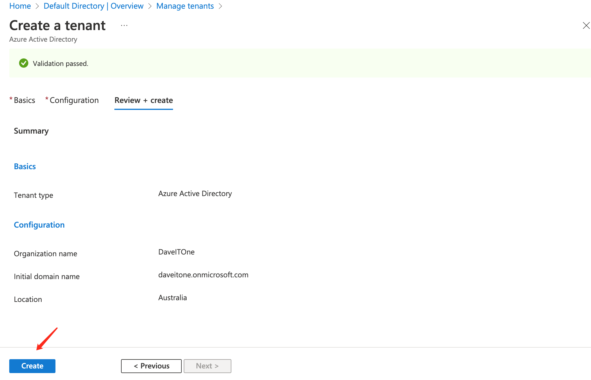

Once you create a new Tenant, a new user belongs this Tenant/Directory will be created automatically, under the new domain

- Tenant: DaveITOne

- Tenant: Default

**Switch Tenant:**

**Swtich Directory:**

# 2. Windows Server AD(ADDS) vs Azure AD

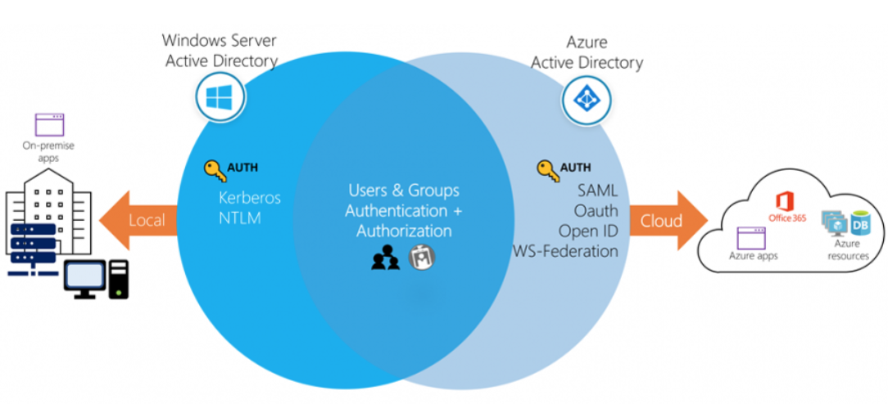

Windows Server AD: Provides an identity and access management service that's managed by your own organization in **on-premises environment**

Azure Active Directory: **cloud-based** service

Communication Protocols: 

​	Azure AD is **HTTP/HTTPS** based, it does not use Kerberos/NTLM(Windows AD authentication method) authentication

​	Azure Authentication: **SAML**, WS-Federation, and OpenID Connect

​	Azure Authorization: **OAuth**

**Azure AD Connect** synchronizes user identities between on-premises Active Directory and Azure AD

Azure AD provides extra features(for example, MFA, Single single-on, Self-service, etc)

AAD has flat structure, whereas Windows AD has OU structure

# 3. Create New User in Azure AD

In Default Directory:

Example: Create a new user under Default Directory(Default Tenant)

**.onmicrosoft.com**: is a default domain that Microsoft assigned

You can also create your custom domain if you have your own public domain

New created Azure user needs to change their password at first logon

ZZyy522927. - zzYY522927.

Choose **Skip for now** to skip MFA setup

But after 14 days for initial login, user needs to set up MFA

New account with Roles and Groups unchanged doesn't have access to any services

**By default, new users don't have access to any services except for Azure portal, for example SQL databases. If access is required, we can use RBAC to assign proper role to user and provide access**

**Each user can also create its own Tenant structure, and all users of this Global Admin Account have the Default Directory as the Global Admin Account does**

Each Azure user can create its own Tenant

**demouser1** creates a new Tenant **demouser1tenant1**

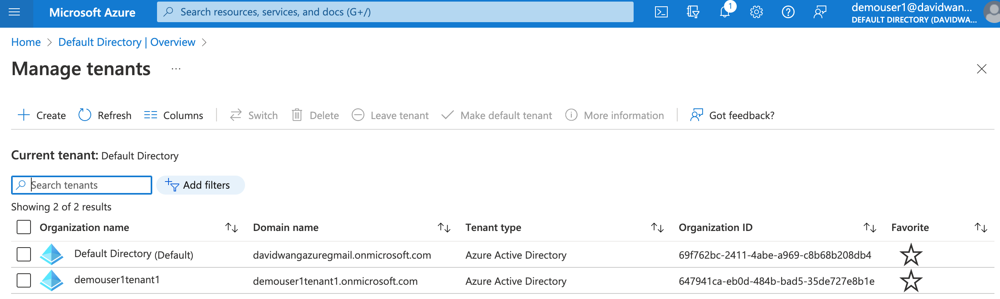

**Within these Tenants, users and groups can be created**

# 4. Azure B2B - Create External or Guest User in Azure AD

**B2B:** Invite external users from other organization to work in your Azure

It can be users from other company's AAD tenant, or External user from partner, vendor, supplier without using Microsoft Account

Azure Cloud Identities:

- Users exist only in Azure AD

- your AAD or external AAD

Guest Identities(External Identities):

- B2B collaboration:
  -  External User
  - Other organization's Tenant

Directory-synchronized(Hybrid Identities)

User type example:

**User type:**

- **Guest**: user comes from **other organization's AAD tenant** or **external users(none MS email)**

- Member-Yes: user comes from your on-premises Windows AD, and synced to your AAD

- Member-No: user is created directly through your AAD 

**Demo:** B2B collaboartion

Steps to invite B2B users:

- admin sends invitation to external user

- external user accepts invitation

- verify **myapps** login

- create Microsoft Account manually

- login Azure

Example: Invite external user

1. invite external user by email 

External user means user with none Microsoft account - davidwangmelvic@gmail.com

Create with Global Admin Account, under Default Directory

2. Guest email Accept invitation

3. Azure account configuration

4. choose **Ask later**, otherwise MFA setup is required

It will login https://myapplications.microsoft.com/#optIn be default 

**External user has no apps available at default**

5. Create Microsoft Account manually

davidwangmelvic@gmail.com -- ning0803030221

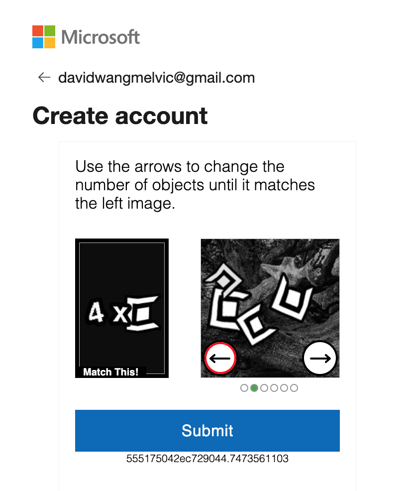

**Once Microsoft Account Created, this external user will be exactly same as other AAD users and external user can use the external email to login Azure**

**Be default, external account doesn't belong to any Directory**

**Be default, external account doesn't have any access to any service or resource**

# 5. Azure AD B2C vs B2B

- Azure AD B2C is **a separate service** from Azure Active Directory(Azure AD)
- It is built on the same technology as Azure AD but for a different purpose
- It allows business to build customer facing applications, and then allow anyone to sign up into those applications with no restrictions on user account

**B2B VS B2C:**

- B2B: your organization admin will invite user from external organization and this user will become a part of your organization's AAD
- B2C: your organization admin will need to create a B2C tenant, then register applications/software into this B2C tenant, then end user can register your apps with existing account allowed in the list
- B2C tenant: It is an app of your organization

**Resgister Azure Free Accout to Microsoft AzureActiveDirectory**

**Create B2C tenant**

**Identity Providers:**

**Everytime you login Azure, you will login as one tenant, and you need to switch between different tenant**

# 6. Bulk User Create

## 6.1 Download user in Bulk

Bulk operation results

## 6.2 Create user in Bulk

Required: mandatory column

**user should come from one of the verfied domain name of the organization/tenant**

If organization's domain is davidwangazuregmail.onmicrosoft.com, then user must also come from this domain

upload file

**must be in .csv format, and edit file from the one downloaded**

check result

# 7. Azure AD FREE vs Premium Licensing

https://www.microsoft.com/en-au/security/business/identity-access/azure-active-directory-pricing

Check current AAD plan

Check features for current license

After 30 days Free trial, Azure will disable any active licenses and won't charge you, unless you manually active them.

AD premium P2 30 days trial only can be used once.

# 8. Azure AD Groups

Two different Azure groups:

- Security: assign permission to a group and all users in the same group will inherit group permission
- Microsoft 365: invite people who are outside our organization, and we share out mailbox, calendar and other resoureces to external users and organisations

Example: Create group

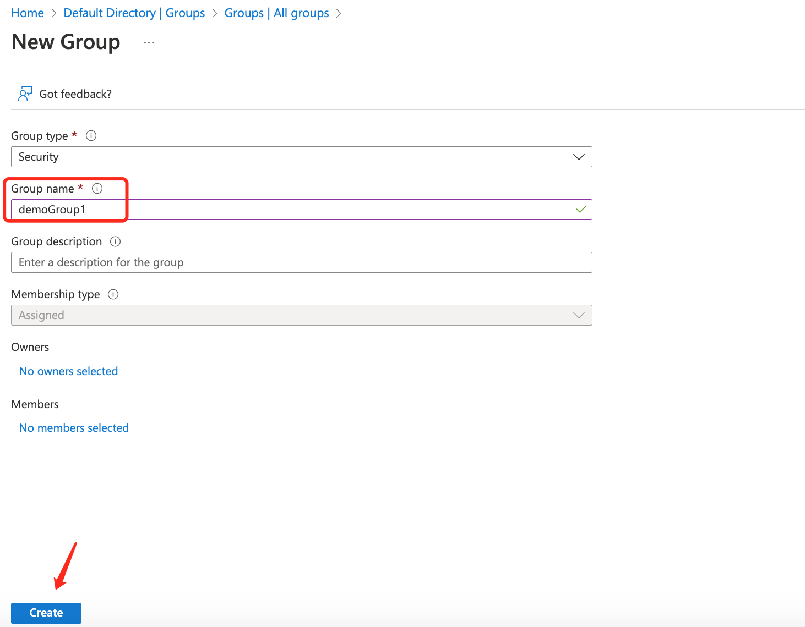

Example: Assign members and owner of the group

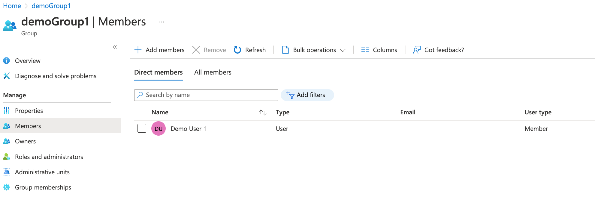

Wait for a bit and refresh

# 9. Azure AD Dynamic Groups

Dynamic Group: 

- there is no particularly group for Dynamic Group
- change Membership type to **Dynamic User**
- Dynamic means all users that meet a certain criteria(eg: Country is Australia), will be added to this group automatically, once created
- this will apply to both new users and existing users, once meet a certain criteria(eg: Country is Australia), users will be added to this Dynamic Group
- AD Dynamic Group feature requires Azure AD Premium P2 license

Change a user's country to Australia

Now, Demo User-2 and Demo User-3 both have Country or region as Australia

**Dynamic rule process** will action after a while, sometimes a few minutes, sometimes a few hours. Then Dynamic groups and users will sync

Normal/Assigned Group can also be converted to Dynamic Group

**rule is not case sensitive, country=Australia is same as country=AUSTRALIA**

# 10. Azure AD Roles

In Azure, we can manage user and group permission via Role

Each role gives a user different permission

**Example:** Assign **User administrator role** to DemoUse1

By default, users have no default and they cannot create other users, but they can see users within the same domain

Login DemoUser1

Assign role to user

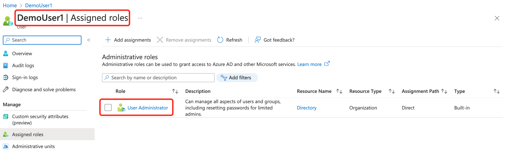

Switch to DemoUser1

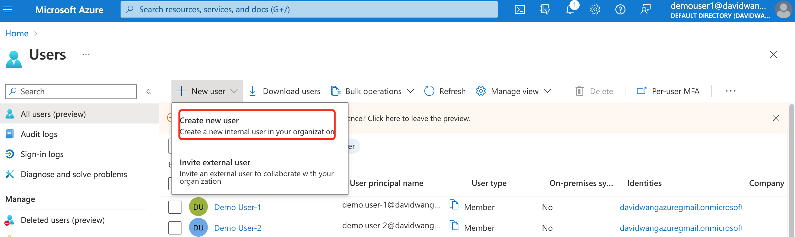

**Example:** Manage AD roles on a Group level

Azure AD group by default cannot be assigned any roles, we need to choose **Azure AD roles can be assigned to the group**

Once select, either it is YES or NO, it cannot be changed in the future

**Azure AD roles can be assigned to the group** must be selected while creating the group

add members to this new group demoGroupRole1

assign roles to the group

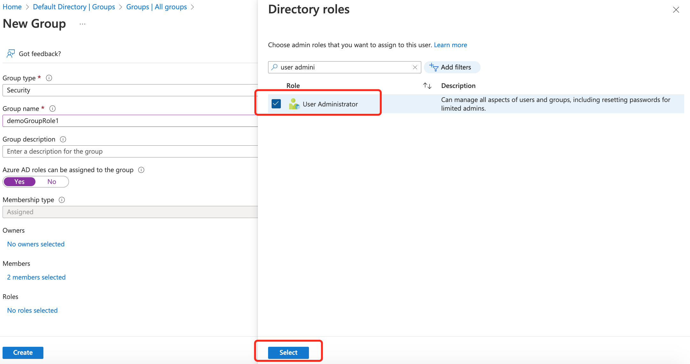

now, all users in this new grouo should have **User administraor** role

try login from these two users and try create users

**demo.user-1@davidwangazuregmail.onmicrosoft.com** ZZyy522927.

# 11. Azure AD Roles vs RBAC Roles

Azure AD Roles:

- used for Azure AD related access
- roles only needed for Azure Active Directory, called Azure AD administrator roles
- Manage access to Azure Active Directory resources
- Scopt is at the **tenant** level
- Examples:
  - Creating users/Groups/Roles
  - Managing Password
  - Billing/Payment Info

RBAC Roles:

- used for non-Azure AD related access, such as SQL access, Virtual Machine access, etc
- RBAC Roles
- Manage access to Azure resources
- Scope can be specified at multiple levels(management group, subscription, resource group, resouce)
  - Create Database
  - Create/manage/delete VM and other resources

Azure Administrator Role example:

**Assigned roles** are Azure Administrative roles

RBAC Role example:

**Azure role assignments** are RBAC roles

# 12. Administrative Units

Azure AD administrator roles scope is at the tenant level. If one user has **User Administrator** role, then this user can manage all users within the same tenant/AAD/organization

**Administrative Units** can break down administrative access

For example, Admin A can only manage users in office A, and Admin B can only manage users in Office B, etc

We can create Adminitrative Unit Office A, then add users to Office A, then assign Admin A to this Administrative A

# 13. Demo Administrative Units

Steps:

1. Create a Administrative Unit - Office A
2. Create a User, called Admin A, then assign User Administrator role to this Admin A user
3. Add usera1, usera2 to this Administratibe Unit - Office A
4. Create group grpOfficeB and add this group to Administrative Unit - Office A, then add userb1 and userb2 to this group grpOfficeB
5. leave userc1 as individual user
6. Result: 
   - Admin A will be able to manage usera1, usera2 and grpOfficeB itself
   - Admin A will not be able to manage userc1, userb1 and userb2. This is because userb1 and userb2 are not added into Office A, it is the group which is added to Office A Adminstrative Unit
   - User must be added into Administrative Unit directly, so that it can be managed by Administrative Unit admiin, such as Admin A in this case
   - From the organization level, there is  an organizational administrator who can manage all users and groups no matter if they have been added to Administrative Unit or not

Demo：

1. Upload bulk user creation file 

2. Create group grpOfficeB and add userb1 and userb2 into this group

3. Create an Administrative Unit

Administrative Unit only have certain roles available

Administrator of an Administrative Unit is assigned when creating the unit

4. Assign members to this unit

5. Assign AD group to this unit

6. Login Azure with Admin A user and verify access 

admina@davidwangazuregmail.onmicrosoft.com

- usera1 and usera2 in OfficeA Administrative Unit can be managed by Admin A as they are added directly into Office A

- Admin A can manage grpOfficeB, as this group is added directly into the Administrative Unit

- Admin A cannot manage userb1, userb2 and userc1, as userc1 is not added into the unit and both userb1 and userb2 are added into the grpOfficeB, rather than the unit directly

# 14. Quiz - User and Group accounts

# 15. Demo Custom Domain

When registering in Azure, a personal or business email is often used, such as 123@hah.com or admin@google.com

This account will be working as a global admin account and there will be admin users created to manage access and normal users created to use Azure services

By default, when creating other users within this global admin account(for example 123@nah.com), a default domain nah.onmicrosoft.com will be used. Therefore, if username is user1, then login name with be user1@nah.onmicrosoft.com

You can also customize the domain name, but you will need to have a public domain name registered in public DNS provider

For example, if you have a domain called `daveit.com`, you just need to register this domain in Azure and the domain provider , then you will be able to choose this domain when creating users

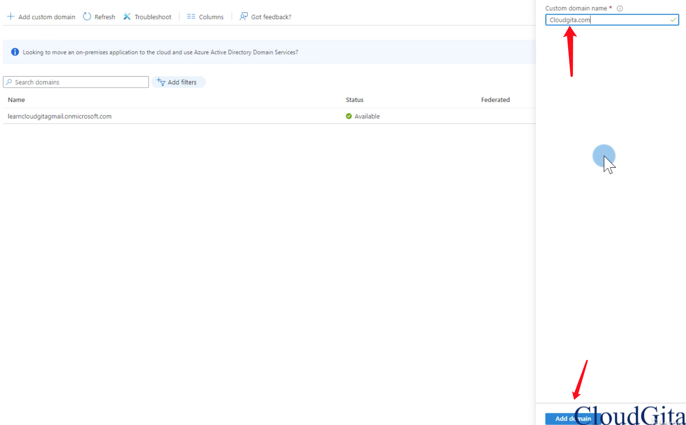

To user Cloudgita.com with your Azure AD, create a new `TXT` record with your domain name registra using the info below. For example, Google Domain

Wait for a few minutes, because ometimes, it may take time to reflect in Azure

Click Verify

Go back to custom domain, the one just created will show up

Next time when you create a user, you can choose the one just created

You can also make this one as the default/primary domain, so it will be picked up automatically

# 16. Azure AD Device Management

Azure AD - Identity and access management service

- Identity - users, groups, applications or **devices**

Make sure devices are secure, compliant and not vulnerable

Capabilities: SSO, Conditional Access

There are three ways to register a device into Azure:

- Azure AD **registration**: Users want to use their own devices to login corporate resources
  - **User-owned devices (BYOD)**
  - Use **local user account** to login in to device, then use **corporate account** to access resources
  - No access to **on-premises** infrastructure, for example on-premises Active Directory
  - Limited management
  - Windows 10 or newer, iOS, Android, and MacOS
  - Example: A user in your organization wants to access your benefits enrollment tool from their home PC

- Azure AD **join**: Join device to Azure AD, then user can use their Azure ID to login this device
  - **Corporate-owned devices**
  - **Corporate user account**
  - Full Intune management
  - Windows 11 and Windows 10 devices, Windows Server 2019 Virtual Machines running in Azure
  - Example: workers who work from home or are in remote branche offices with limited on-premises infrastructure

- Hybrid Azure AD join
  - Suitable for hybrid organizations with existing on-premises AD infrastructure
  - Joined to on-premises AD and Azure requiring organizational account to sign in to the device
  - Gives your all the benefits of being cloud enabled with still having full access to your on-prem infrastructure

# 17. Demo - Azure AD Device join

Device Management - Corporate Device Join into Azure AD - So user can login this device using their Azure ID

Example: Create a **Free** Virtual Machine and Join it into Azure AD

**Must go to Free Services first, then create VMs, otherwise it will be charged**

Create VM

Connect to VM

# 18. Demo - Azure AD Device Register

**Register Windows Laptop BYOD** device to Azure AD

1. Search for **Access work or school**

2. Enter your own Azure Login ID

3. Click **Next** and it will load and finish
4. Go to Azure AD - Device and make sure device is there

# 19. Demo - Self-Service Password Reset(SSRP)

**Azure AD Premium P2** license is required for SSRP

Azure Free subscription can have free Azure AD Premium P2 license for 30 days and 100 licenses assigned to users

1. Assign P2 license to Demo User-2

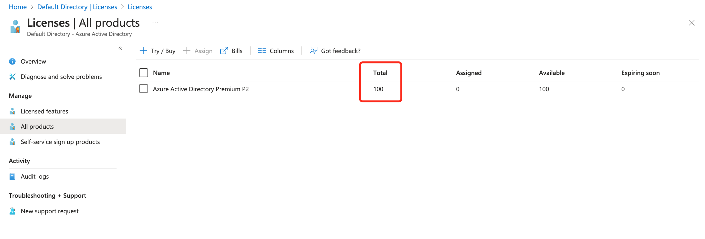

The reason is some Microsoft offerings are not available in specific regions because of local laws and restrictions. So unless you specify a usage location for the user, you cannot assign those license offerings which are region specific

2. Enable self password reset policy

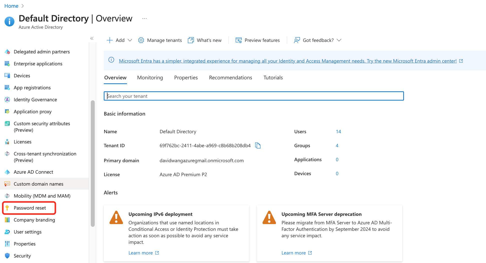

3. Choose Authentication Method, make sure only the user himself/herself can reset the password, not anyone else

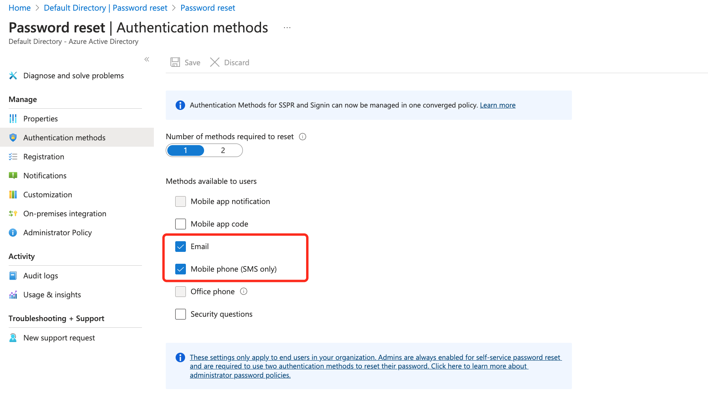

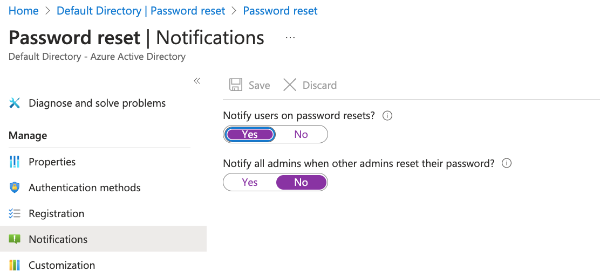

4. On-premises integration

Azure AD and On-premises AD can sync between each other through Azure connect service

AAD -- AD: write back password to your on-premises directory

5. Make sure user has mobile number in his/her profile

6. Test SSPR

# 20. Multi-factor Authentication

Two processes that enable secure authentication: **Azure AD Multi-Factor Authentication** and **Conditional Access**

Multifactor authentication provides additional security for your identities by requiring two or more elements to fully authenticate

- Something the user knows: This might be an email address and password
- Something the user has: This might be a code that's sent to the user's mobile phone(OTP code, one-time passcode)
- Something the user is: This is typically some sort of biometric property, such as fingerprint or face scan that's used on many mobile devices

Multi-factor authentication is recommended for administrative accounts

Azure AD Multi-Factor Authentication: phone call or mobile app notification

There are 4 different ways to enforce MFA

- Security Defaults: Basic Azure License, user has 14 days to setup MFA from their first logon
- Conditional Access: P2 License, define **who** needs to setup MFA when logon **which** application from **where**
- Enable MFA per-user: MFA will be triggered whenever that user accesses any cloud service
- Enable MFA through Azure Identity Protection: P2 License required

Example: enable MFA for single user to login Azure

Phone number method is through text message

login with Demo User-1

# 21. Conditional Access

Azure Active Directory uses Conditional Access to grant (or deny) resource access based on **identity signals**

- who the user is (Administrator or normal user)

- where the user is (usual or unexpected location)
- what device the user is requesting access from(is this a new device)

Based on signals, Azure Active Directory can decide to allow, deny, or require MFA access

Multi-authentication will be required, only if sign-in signals are unusual(for example unexpected location)

Conditional Access is not Free, it requires Azure AD Premium P1 or P2 license

# 22. Demo Conditional Access Policy

Example: Enable Conditional Access for User **Demo User-3**

Add authentication method for this user

Make sure multi-authentication is disabled

Create Conditional Policy

Apply Conditional Policy to which user or group

Apply Conditional Policy to which application

Microsoft Azure Management app is https://portal.azure.com/

When this user **Demo User-3** is logging in https://portal.azure.com/, Conditional Policy will be applied

How to define conditions

Directly grant access to Microsoft Azure Management app, but require Multi-factor authentication

Right now, we have a Conditional Policy for Demo User-3, when it is logging in Microsoft Azure Management portal, Multi-factor authentication is required

For this error, disable Security defaults and create Conditional Access policy again

Create Conditional Access Policy again

Test login

**Delete Conditional Policy and Restore Security Default**

They cannot be used at the same time

 

# 23. Monitor user sign-in

# 24. Quiz

