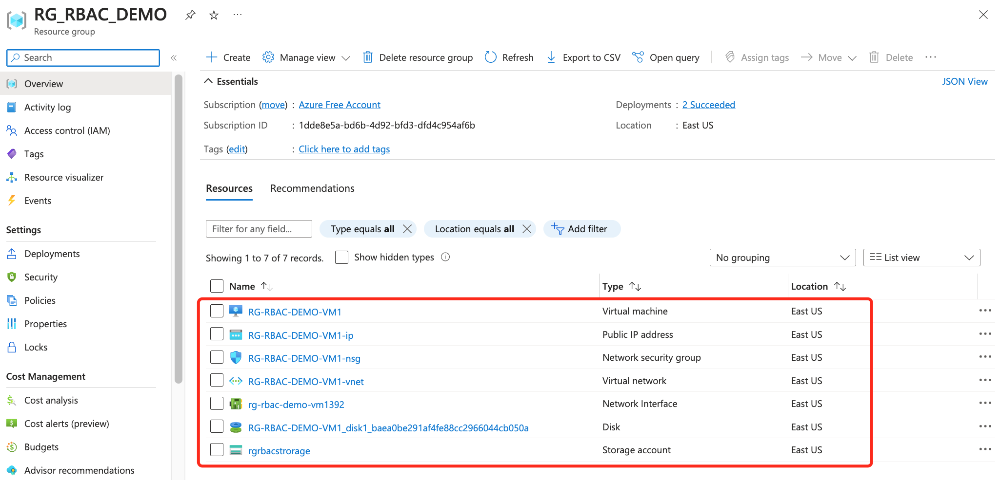

# Azure Role Based Access Control

# 1. RBAC

RBAC means providing users access based on the **Role** they have

Azure RBAC is a system that allows control over who has access to which Azure resources, and what these users can do with those resources

Azure admin can assign a Role to a user based on different levels of accesses, Resource Level, Resource Group Level, Subscription Level, Management Group Level

It consists of three elements:

- Who has access to Azure resources?

  - Security Principal - An identity that gets the permissions. It could be a user, group, or a service principal

  

- What they can do with those resources?

  - Role definition - A collection of permissions
  - **Reader:** Read Access
  - **Contributor:** Read, Update and Delete
  - **Owner:** Read, Update, Delete, Grant Access to other users
  - **Resource Specific:** Only give a user Administrator Role for virtual machine, not for other services
  - **Custom:** If none of the above roles meet the requirement, Azure administrators can create Custom Roles 

  

- What is the Scope of access?

  - A way to constrain where those permissions are applicable
  - The role assigned to user,  can apply on which level; scope defines at what level that we are providing the access
  - management group > subscription > resource group > resource
  - If user is the admin for one particular resource, for example a virtual machine, then he/she cannot manage other virtual machines
  - We can also provide user access to the whole resource group, so the user can manage all resources in the resource group

- You can assign multiple Azure Roles to a user

  - if a user has been assigned both Reader and Contributor roles, then the Contributor role will take effective

- You can create your own Custom Azure Roles to assign Custom Permissions

- You can assign Roles using the Azure portal, Azure CLI, Azure PowerShell, Azure SDKs, or REST APIs

# 2. Demo RBAC

Reader - **View Only**

Contributor - **Read + Manage(Update/Delete)**

Owner - **Read+Manage+Grant Access to other users**

**User Access Administrator** - Specific Role to manage user access

**Deny Assignments**

- Similiar to Windows Deny Files Permission
- Blocks users from performing specific actions even if a role assignment allows it
- **Deny assignments** can only be created using **Azure Blue Prints** or **Managed Apps**

**Demo:**

1. Create a Resource Group **RG_RBAC_DEMO**

2. Create a VM and a Storage Account in the Resource Group

- Create a VM

- Create a Storage Account

- Verify Resources created in the **RG_RBAC_DEMO** Resource Group

3. Assign **Read Role** to user **Demo User-2** to this VM at **Resource Level**

**Access control(IAM)** in every Resource is used to control access to this Resource

**Azure Global Administrator** is the **Owner** of all resources, therefore Azure Global Administrator account can Grant access to other users for all Resources

**Demo User-2** doesn't have any access to this VM

Assign Read Access at Resource Level to Demo User-2

**This Resource Level Read Access Role is restricted to this Virtual Machine Resource, Demo User-2 can only Read this Virtual Machine Resource, cannot Read the rest Resoureces such as Network Interface, Disk and other Resources**

**Resource Level access will be applied to the actual Resource, which is RG-RBAC-DEMO-VM1**

4. Verify user can only Read VM, but not able to change VM or Read Storage Account

In **All resources** tab, this user can only see this Virtual Machine, but not able to see the **Storage Account**

This user cannot manage this Virtual Machine, for example Restart VM

This user can verify his access to this Virtual Machine Resource

5. Assign Owner Role to Demo User-2 at Resource Group Level of RG_RBAC_DEMO Resource Group

Resource Group Level should be added within the Resource Group

**Demo User-2** will now have the **Owner** Role of RG_RBAC_DEMO Resource Group at Resource Group Level 

6. Verify user can manage all Resources in the Resource Group

Restart VM

Delete all Resources in the Resource Group

Delete Resource Group **RG_RBAC_DEMO**

7. Assign **Contributor** role in the **Subscription Level**

Once a user is assigned **Contributor** role of a Subscription in the Subscription Level, this user will have access to manage(Read/Update/Delete) all Resource Groups and all Resources within this Subscription

# 3. Azure RBAC - Custom Role

**Custom Role cannot be created at the Resource Level, it has to be created at minimum the Resource Group Level**

1. Create a Resource Group RG_RBAC_CUSTOM_ROLE

2. Check Custom Role availability

Custom Role is available at minimum Resource Group Level

Custom Role is not available at Resource Level

3. Create Custom Role for Resource Group RG_RBAC_CUSTOM_ROLE

- Clone a role

Clone an existing role then edit the permission

- Start from scratch

Confirm the Roles required before creating Custom Roles

Create this Role at Resource Group Level

Verify the Custom Role created

- Start from JSON

# 4. Quiz

RBAC is assigned to Resource, Resource Group, Subscription and Management Group

Azure AD Role is assigned to Azure AD Resources such as User, Groups and Domains

**Azure AD Roles:**

- used for Azure AD related access
- roles only needed for Azure Active Directory, called Azure AD administrator roles
- Manage access to Azure Active Directory resources
- Scopt is at the **tenant** level
- Examples:
  - Creating users/Groups/Roles
  - Managing Password
  - Billing/Payment Info

**RBAC Roles:**

- used for non-Azure AD related access, such as SQL access, Virtual Machine access, etc
- RBAC Roles
- Manage access to Azure resources
- Scope can be specified at multiple levels(management group, subscription, resource group, resouce)
  - Create Database
  - Create/manage/delete VM and other resources
