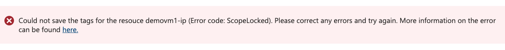
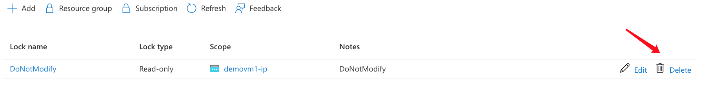
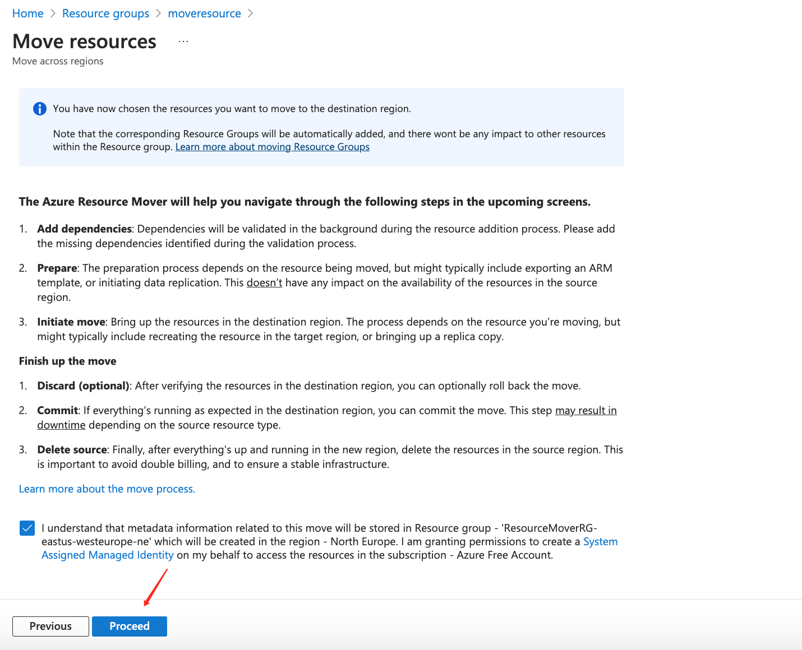
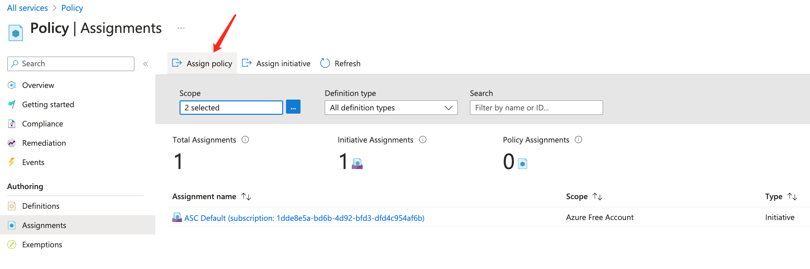
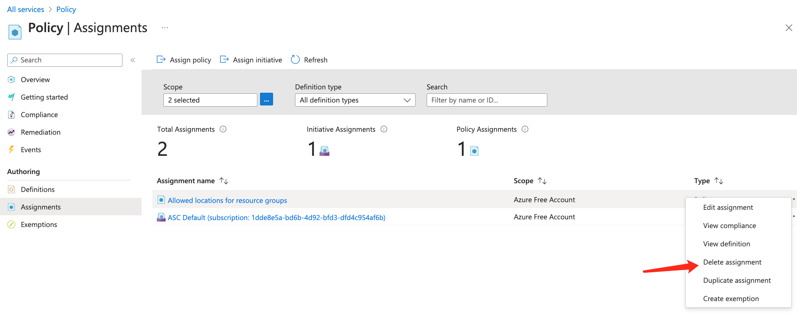
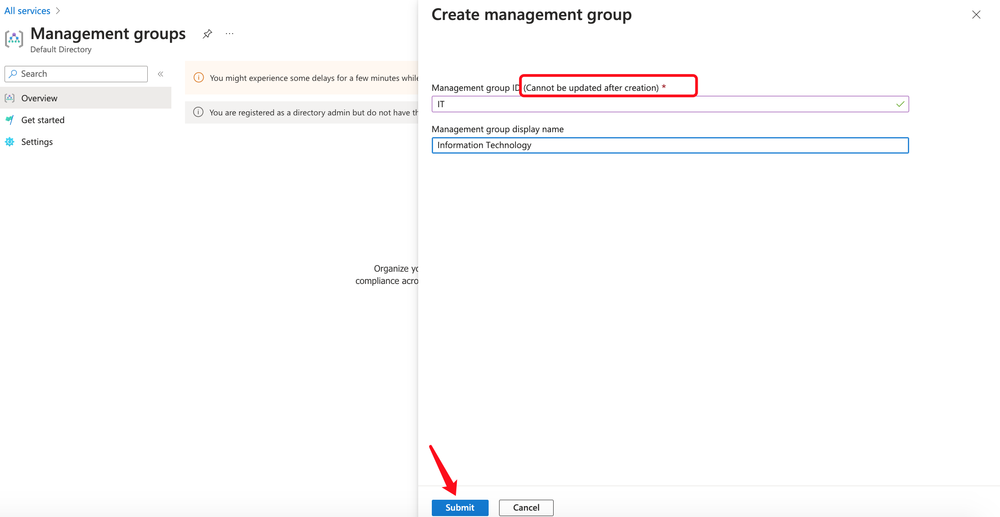

# Azure Subscriptions and Governance

# 1. Subscription

Subscription is a separate service in Azure

A resource is created under one Subscription

Using Azure requires an Azure subscription, without a subscription, you cannot use Azure

An Azure subscription is a logical unit of Azure services that links to an Azure account. It also allows you to provision resources

A subscription provides you with authenticated and authorized access to Azure products and services

Azure generates separate billing reports and invoices for each subscription

There are two types of subscription boundaries:

- Billing boundary
- Access control boundary

Administrator can create sepearte subscription based on:

- Environment: Development, Testing, Security, or to isolate data for compliance reasons
- Organizational Structure: IT, HR, Admin and so on
- Billing: Manage and Track costs based on your needs, For example - Production, Test and Dev

One Azure account can have multiple Subscriptions. 

Each Subscription will decide two things:

- Billing: how you are charged by Azure 

  Each Subscriotion has its own monthly bill. For example, If you have 5 subscriptions, then you will have 5 bills each month.

- Access: define your access to different resources. For example, Free Subscription doesn't have access to create expensive virtual machines; how many virtual machine can be created, how much you can spend each month, etc.

- For example: One company can set up two subscriptions, one for Development environment and one for production environment. For Dev environment, monthly bill can be restricted within certain amount, as for Prod environment, there won't be such restriction.

 

Different types of Subscription:

	- Free: An email address and a credit card are required to sign up for a free trial subscription that provides $200 credit for the first 30 days and 12 months of restricted access
	- Pay-Per-Use: Charges monthly based on Cloud resource use
	- Enterprise: A single Enterprise agreement is established for large subscription purchases, including savings for new licenses and software assurance
	- Student: This membership includes $100 for 12 months and may be activated without a credit card

**Use subscription to control billing and restrict access **

# 2. Create a Subscription

**One subscription** can only be associated with one **Active Directory**

If you don't see the new subscription showing up, go to Switch Directory and tick the new subscrition created

Then go back to Subscription

# 3. Trust Relation between AAD/Tenant and Subscription

An Azure subscription has a trust relationship with Azure Active Directory (Azure AD)

A Subscription trusts Azure AD to authenticate users, services and devices

**Multiple Subscriptions can trust the same Azure AD Directory**

**Each Subscription can only trust a single directory, and each Subscription has to be associated with one Azure Active Directory**

Azure tenant and Azure Active Directory has one to one relationship

Example: **One subsction can only be associated to one Azure Active Directory**

Example: Associate one Subsctiption to another Azure Active Directory

Once this Subscription is changed to another Azure Active Directory, you will need to switch to the right Active Directory to see the Subscription

Switch back to Default Directory

# 4. Azure Tags

Use Tags to categorize Resources and Resource Groups

Tag consists of **Name** and **Value**. With Tags, you can filter Resources and Resource Groups

Example: Create Tags for Resources, Edit view columns and add Filter

- demovm1-vnet

- demovm1-ip

You can organize the sequence by dragging the bar up and down

Tags is also an Azure service, you can check all resources of one Tag

You can also analyze Cost information based on Tags

**Tags will show up after in a day or 2 once created, so we cannot see Tags at the moment**

But, tomorrow, we can filter by Tags

Summary:

- Azure Tags are the **name:value** pairs that help to organize the Azure Resources in the Azure Portal
- Azure Tags are simply **Labels** that you can attach to your Azure Resources
- You can use tags to easily group and classify Resources and Assets in Azure
  - For example, get the costs generated by Resources having the same Tag applied
  - Tagging is a Primary way to understand the data in any cost or Billling Report
- Resources don't inherit any Azure Tags applied at the Resource Group Level

Example: Apply Tag "Customer:Ebay" to Resource Group "demovm", this Tag won't be applied to Resources of **demovm** Resource Group

Confirm Resources won't inherit the Tag applied at the Group Level

- It's a fundamental part of any well-managed environment. It's also the first step in establishing proper governance of any environment

- Azure Policy can be used to enforce Tagging Rules and Conventions
  - For example, you can require that certain tags must be added to new resources as they are provisioned

# 5. Azure Resource Locks

With Resource Locks, accident resource modification and delete can be prevented.

## 5.1 Resource Lock

- Read Only Lock: No one can make any changes of this Resource, No one can delete this Resource

**demovm1-ip**: apply Tag will fail

**demovm1-ip**: delete Resource will fail

- Delete Lock: No one can delete this Resource, but can modify

Delete Read Only Lock

Add Delete Lock

Unable to delete

But able to modify, for example, apply Tag

With Lock, even the Owner of the Resource cannot perform actions

## 5.2 Resource Group Lock

Resource Group Lock will be applied to **ALL Resources** in the Resource Group

Remove ip Resource Delete Lock

Apply Delete Lock to Resource Group

ip Resource can be managed by Lock, nsg and vnet cannot

# 6. Moving Resources

Move Resources between Resource Group and Subscription

Move any Resource from one RG to another RG

Move any Resource from one Subscription to another

The physical location of  Resources moved won't change as location information is managed by RG as meta data. For example, if a Virtual Machine is in East US, then we move it to another Resource Group and this Group is East-EU, the Virtual Machine's physical location is still in East-US

Therefore, the location of Resources can be different to their Resources Groups

East US:

When moving a Resource, for example a Virtual Machine, it is suggested to move all Resources related together

Move to West Europe

**Disk cannot be moved**

**Resource and RGs with Read Only Lock cannot be moved**

**?????????**

# 7. Azure Policy

Apply restrictions, rules and enforcement to avoid mistake like creating a very expensive Virtual Machine

All services -- Management + governance - Policy

Click **Assignments** to assign policy/rule on our Resources

**Policy can be assigned at either Subscription Level or RG Level**

**Policy Definition**

Only specific locations are allowed to choose when creating **Resource Group**

**New Policy will take 30 mins to be effective**

Check All Existing Policies available

There are two types of Definitios:

- Policy
- Initiative: a group of different policies

**Remediation:** Enfore defined policies on defined RGs

**Once you apply a policy, those existing Resources that are not complied with this policy won't be deleted, but will show as Non-complaint**

Summary:

Azure Policy can help you control or restrict or audit your resources

Enforce rules on Azure Resource configurations to make sure they remain complaint with corporate standards

You can apply individual policy or group of policy (Initiatives)

Two important task:

- Prevent Non-complaint resources from being created
- Highlights existing resources that aren't complaint with the policies

Examples:

- Allow only a certain size for the VMs to be provisioned
- Mandatory Tags to be created while provisioing Resources
- MFA should be enabled on accountw with write permissions on your subscription

Assign Policy within a specific scope(management group, a single subscription, or a resource group)

Policies assignments are inherited by all Child Resources within the scope

- You can exclude specific Child Resources you need to be exempt from the Policy assignment

You can review the Noncpmpliant Policy results and take any action that's needed

**Delete assignment**

**Delete of assignment will also take 30 mins to be effective**

# 8. Quiz - Azure Policy

# 9. Management Groups

Organize multiple subscriptions as a single management entity

- Management groups let you organize multiple subscriptions as a single management entity to facilitate easier management
- You can create management groups in a hierarchical structure with the top level of the hierarchy at the tenant level and containing all subscriptions in the tenant

- **Root Management Group is the top level of the hierarchy**
- Any conditions applied to a management group apply to all subscriptions contained in that management group object

- Each management group and subscription can support only one parent
- Each management group can have many children
- The root management group can't be moved or deleted, unlike other management groups

Demo:

Be default , even the global admin doesn't have access to manage Root Management Group. 

We need to elevate Global Admin's access first

Create child management group within IT management group

Add Subcription to DevOps management group. 

If there is subsciption that hasn't been associated to other management groups, then you can add it to a management group.

Define Security and Policy at the management group level.

Security and Policy created at the management group level will be inherited to child management group and child subscription.

# 10. Azure Cost Management and Billing

This is a built-in service that gives you a breakdown of the usage and cost of your Azure resources

This allows you to see what is costing you money and how it compares against your budget

You use Cost Management + Billing features to:

- Conduct billing administrative tasks such as paying your bill
- Manage billing access to costs
- Download cost and usage data that was used to generated your monthly invoice
- Proactively apply data analusis to your costs
- Set spending thresholds
- Identify opportunities for workload changes that can optimize your spending

Cost can be viewed based on Subscription, Resource Group, Region, etc

Budget can also be configured according to Subscription, Resource Group and so on

Advisor recommendations: Provide suggestion on how to reduce cost

# 11. Quiz - Configure Subscriptions

