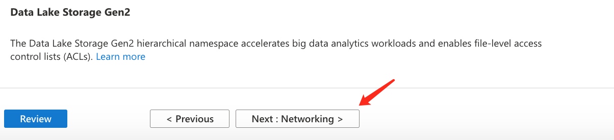
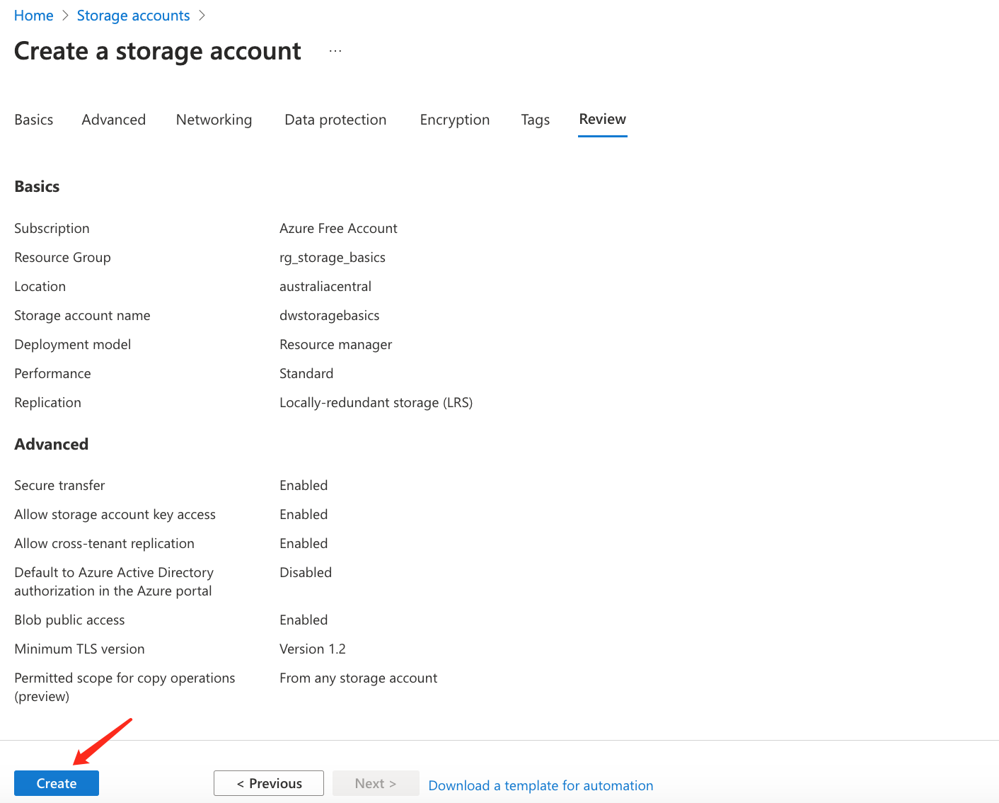
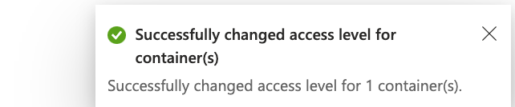

# Azure Storage - Basics

# 1. Azure Storage Services Overview

## 1.1 Different types of data and requirements

- Relational, non-relational/No-SQL, datasheets, images, videos, backups
- Storage, access, security, availablity, latency, processing, backup

## 1.2 Azure database services

- Azure Cosmos DB: No-SQL database
- Azure SQL Server
- Azure MySQL DB
- Azure MariaDB 

## 1.3 Azure storage services

- Storage accounts
- Microsoft has combined 4 types of storage services into one service called **Storage Services**
  - Containers: as knows as Blob Storage, **Binary Large Object**
  - File shares:
  - Queues:
  - Tables:


## 1.4 Different types of Data Service

- Azure Blobs: Text and Binary data, storage large file, image, video, etc
- Azure Files: Managed file shares(SMB(Server Managed Blob) Protocol), share file with other servers/applications
- Azure Queues: Messaging, MQ applications
- Azure Tables: NoSQL store, CosmosDB

## 1.5 Azure Storage Service Features

- Durable and highly available - redundancy across datacenters or regions
- Secure - all data encrypted by default
- Scalable - massively scalable
- Managed - Azure handles hardware maintenance, updates, and critical issues for you
- Accessible - accessible from anywhere in the world over HTTP or HTTPS
  - Clients libraries are available in all languages
  - Support scripting in PowerShell or Azure CLI

# 2. Demo - Provision Azure Storage Account


**Storage account name** must be unique in the whole Azure Domain, not just your Azure Domain, as you will need this name to access your storage from the browser


Performance:

- Standard: with standard performance, you will have all four types for storage available
- Premium: with Premium performance, you can choose only one specific type of strorage, but you will have low latency with this type of storage service
- Once your account is created, you won't be able to change the Performance type. You can only create a new Storage Account, then migrate all files to the new account

Redundancy: different regions have different redundancy plan available.

- Redundancy plan can be changed later after account is created

- Australia Central

  

- US West 3


Here I select Australia Central - LRS


Keep Advanced Settings as default




Keep Data protection as default


Keep Encryption as default


Leave Tag empty


Create strorage account




Verify Storage accounts created


# 3. Data Redundancy Options

## 3.1 Redundancy Overview

- Protect your data from hardware failures, network or power outage, and natural disasters

- Redundancy: make multiple copies of your data

- Even in the event of a failure, redundancy ensures your storage account's **availability and durability**

- Tradeoffs between lower costs and higher availability

- Redundancy in the primary region
  - Locally redundant storage(LRS) - Three synchronous copies in same data center on different racks
  - Zone-redundant storage(ZRS) - Three sychronous copies in three availability zones(AZs)
- Redundancy in a secondary region
  - Geo-redundant storage(GRS) - LRS + Asynchronous copy to secondary region
  - Geo-zone-redundant storage(GZRS) - ZRS + Asynchronous copy to secondary region
- With GRS or GZRS, the data in the secondary region isn't available for read or write access **unless** there is a failover to the secondary region

- For **Purely** read access to the secondary region rather than **failover**, configure your storage account to use
  - Read-access geo-redundant storage(RA-GRS)
  - Read-access geo-redundant storage(RA-GZRS)

## 3.2 Local redundant storage - LRS

- Three synchronous copies in the **same data centre**
- One rack saves one copy
- If one rack fails, the other two can still provide service
- If the whole datacenter or the who AZ fails, then no copy will be available


## 3.3 Zone-redundant storage - ZRS

- Three synchoronous copies in three availability zones(AZs)
- Three copies in three different AZs

- If one AZ fails, copies in other AZs still work


## 3.4 Geo-redundant storage(GRS) 

- LRS + Asynchronous copy to secondary region (three more copies using LRS) - **Read only access**
  - Read-access geo-dundant storage(RA-GPS) - Read Access on GRS
- If one region is down, the other three copies in the other region will still provide **READ** access


## 3.5 Geo-zone-redundant storage(GZRS)

- ZRS + Asynchronous copy to secondary region(three more copies using LRS) - **Read only access**
  - Read-access geo-zone0redundant storage(RA-GZRS) - Read Access on GZRS

- In primary region, each AZ saves one copy to prevent AZ failure within primary region
- In secondary region, three copies are saved in three different racks in one datacenter to prevent primary region failure


## 3.6 Read Only

- With **GRS** or **GZRS**, the data in the secondary region isn't available for read or write access **unless** there is a failover to the secondary region

- For **Purely** **Read** to the secondary region rather than **failover**, you can configure your storage account to use RA-GRS or RA-GZRS directly
  - Read-access geo-redundant storage(RA-GRS)
  - Read-access geo-redundant storage(RA-GZRS)

# 4. Blob Storage

## 4.1 Overview

- Blob stands for Binary Large Object
  - Any type of format
  - Text, Images, audio, video, excel, backup files
- User cases:
  - Storing files for shared access
  - Video and audio streaming
  - Strong data for analysis (Data Lake Gen2)
  - Writing to the log file
  - Storing data for disaster recovery, backup, and archiving

- Blob storage uses a Flat structure
  - Create a storage account
  - Within this storage account, you create different containers/folders
  - In each folder, you create different blobs/files
  - You **cannot** create a sub container/folder in the parent container/folder
  - You can create unlimited number of containers within the storage account, but no sub containers in the parent containers


## 4.2 Container Demo

1. Create a new container

**You must create a container first, then you can upload file to this container**


**You cannot upload file without creating a container and you cannot create another container within the parent container**

2. Upload a Blob file


3. Access this file from URL


This error happened because by default, blob file is not allowed to access from the Internet

4. Change access level to Blob




5. Access this file again


6. Unique storage account name


Blob file is accessed from URL, therefore, your storage accout name must be unique, so that each file can be identified uniquely

```bash
https://dwstoragebasics.blob.core.windows.net/testblob/az-140-badge-v1.png
```

## 4.3 Provide a Unique namespace in Azure for your data

- https://dwstoragebasics.blob.core.windows.net

## 4.4 Different types of Blob storages

### 4.4.1 Block Blobs

- For large objects that doesn't use random read and write operations, files that are read from beginning to end
- Such as media files or image files for websites

### 4.4.2 Append Blobs

- Optimized for append operations, e.g. Logs
- When you modify an append blob, blocks are added to the end of the blob only
- Updating or deleting of existing blocks is **NOT** supported
- For example, you might write all of your trace logging to the same append blob for an application running on multiple VMs

### 4.4.3 Page Blobs

- Optimized for random read and write operations
- Provide durable Disks for Azure Virtual Machines

### 4.4.4 Choose Blob type when uploading Blob file


# 5. Storage Service Endpoint

- Every object stored in your storange account has a **unique** namespace


- File URL structure: `Blob Service URL/CONTAINER_NAME/FILE_NAME`

```bash
# testblob is the CONTAINER_NAME
# az-104-badge-v1.png is the FILE_NAME
https://dwstoragebasics.blob.core.windows.net/testblob/az-104-badge-v1.png
```

```bash
Storage Account: dwstoragebasics
Service Access Point: blob.core.windows.net
Container: testblob
File: az-104-badge-v1.png
```

# 6. Azure Storage Performance Tiers

**Important: Once your Storage Account is created, you won't be able to change the Performance plan. You have to create a new Strorage Account and migrate all objects to the new Storage Account**

- Standard
  - Backed by magnetic drives
  - Support - All storage account
  - Optimizeed for high capacity and high throughput
  - Provides the lowest cost per **GB**
  - Best for applications that require bulk storage or where data is accessed infrequently
  - Example: Backup and DR datasets, media, pictures
- Premium
  - Backed by solid state drives (SSD)
  - Good for virtual machines and workloads that need low latency and high I/O performance
  - Example: transactional databases, big data analysis, IOT, AI or ML
  - Block Blob: Best for high transaction rates or low storage latency
  - File Shares: Best for enterprise or high performance applications that need to scale
  - Page Blob: Best for random read and write operations

# 7. Quiz - Blob Storage


